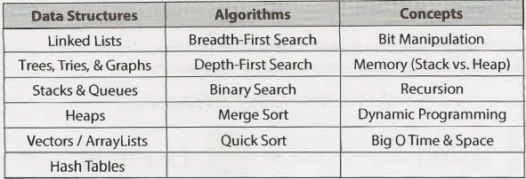

# DSA-Dojo
[Cracking the coding interview](https://www.crackingthecodinginterview.com/) is very good book to learn algorithms and data structures for coding interviews.
In this repository, I have implemented basic problems introduced in that book using python.

  

# Problems List
The image below shows the minimum knowledge that we should acquire for coding interviews.

## Arrays and Strings
### Hash Tables
A hash table is a data structure that maps keys to values for highly efficient lookup. There are a number of ways of implementing this. Here, we will describe a simple but common implementation.
In this simple implementation, we use an array of linked lists and a hash code function. To insert a key (which might be a string or essentially any other data type) and value, we do the following:
1. First, compute the key's hash code, which will usually be an int or long. Note that two different keys could have the same hash code, as there may be an infinite number of keys and a finite number of ints.
2. Then, map the hash code to an index in the array. This could be done with something like hash (key) % array_length. Two different hash codes could, of course, map to the same index.
3. At this index, there is a linked list of keys and values. Store the key and value in this index. We must use a linked list because of collisions: you could have two different keys with the same hash code, or two different hash codes that map to the same index.
To retrieve the value pair by its key, you repeat this process. Compute the hash code from the key, and then compute the index from the hash code. Then, search through the linked list for the value with this key.
If the number of collisions is very high, the worst case runtime is $O(N)$, where $N$ is the number of keys. However, we generally assume a good implementation that keeps collisions to a minimum, in which case the lookup time is $O(1)$.

### Array List
In some languages, arrays (often called lists in this case) are automatically resizable. The array or list will
grow as you append items. In other languages, like Java, arrays are fixed length. The size is defined when
you create the array.
When you need an array-like data structure that offers dynamic resizing, you would usually use an Arraylist.
An Arraylist is an array that resizes itself as needed while still providing $O(1)$ access.
A typical implementation is that when the array is full, the array doubles in size. Each doubling takes $O(n)$ time,
but happens so rarely that its amortized insertion time is still $O(1)$.

### String Builder

  

## Linked List
A linked list is a data structure that represents a sequence of nodes. In a singly linked list, each node points to the next node in the linked list. A doubly linked list gives each node pointers to both the next node and the previous node.  
Unlike an array, a linked list does not provide constant time access to a particular "index" within the list. This means that if you'd like to find the Kth element in the list, you will need to iterate through K elements.
The benefit of a linked list is that you can add and remove items from the beginning of the list in constant time. For specific applications, this can be useful.

  

## Stack and Queue
### Stack
The stack data structure is precisely what it sounds like: a stack of data. In certain types of problems, it can be favorable to store data in a stack rather than in an array.  
A stack uses LIFO (last-in first-out) ordering. That is, as in a stack of dinner plates, the most recent item added to the stack is the first item to be removed.  
It uses the following operations:

- pop() : Remove the top item from the stack.
- push(itern): Add an item to the top of the stack.
- peek(): Return the top of the stack.
- isEmpty(): Return true if and only if the stack is empty.

Unlike an array, a stack does not offer constant-time access to the i th item. However, it does allow constant­ time adds and removes, as it doesn't require shifting elements around.

### Queue
A queue implements FIFO (first-in first-out) ordering. As in a line or queue at a ticket stand, items are removed from the data structure in the same order that they are added.
It uses the operations:

- add(item): Add an item to the end of the list.
- remove(): Remove the first item in the list.
- peek(): Return the top of the queue.
- isEmpty(): Return true if and only if the queue is empty.

A queue can also be implemented with a linked list. In fact, they are essentially the same thing, as long as items are added and removed from opposite sides.

  

## Trees and Graphs
### Binary Tree Traversal
#### In-Order Traversal
In-order traversal means to "visit" (often, print) the left branch, then the current node, and finally, the right branch. When performed on a binary search tree, it visits the nodes in ascending order (hence the name "in-order").

#### Pre-Order Traversal
re-order traversal visits the current node before its child nodes (hence the name "pre-order"). In a pre-order traversal, the root is always the first node visited.

#### Post-Order Traversal
Post-order traversal visits the current node after its child nodes (hence the name "post order"). In a post-order traversal, the root is always the last node visited.

### Binary Heaps (Min-Heaps and Max-Heaps)
We'll just discuss min-heaps here. Max-heaps are essentially equivalent, but the elements are in descending order rather than ascending order.
A min-heap is a complete binary tree (that is, totally filled other than the rightmost elements on the last level) where each node is smaller than its children. The root, therefore, is the minimum element in the tree.

We have two key operations on a min-heap: insert and extract_min.
#### Insert
When we insert into a min-heap, we always start by inserting the element at the bottom. We insert at the rightmost spot so as to maintain the complete tree property.
Then, we "fix"the tree by swapping the new element with its parent, until we find an appropriate spot for the element. We essentially bubble up the minimum element.

#### Extract Minimum Element
Finding the minimum element of a min-heap is easy: it's always at the top. The trickier part is how to remove it. (In fact, this isn't that tricky.)
First, we remove the minimum element and swap it with the last element in the heap (the bottommost, rightmost element). Then, we bubble down this element, swapping it with one of its children until the min­ heap property is restored.
Do we swap it with the left child or the right child? That depends on their values. There's no inherent ordering between the left and right element, but you'll need to take the smaller one in order to maintain the min-heap ordering.

### Tries (Prefix Trees)
A trie is a variant of an n-ary tree in which characters are stored at each node. Each path down the tree may represent a word.  
Very commonly, a trie is used to store the entire (English) language for quick prefix lookups. While a hash table can quickly look up whether a string is a valid word, it cannot tell us if a string is a prefix of any valid words. A trie can do this very quickly.

### Graphs
#### Depth-First Search (DFS)
In DFS, we visit a node a and then iterate through each of a's neighbors. When visiting a node b that is a neighbor of a, we visit all of b's neighbors before going on to a's other neighbors. That is, a exhaustively searches b's branch before any of its other neighbors.  
Note that pre-order and other forms of tree traversal are a form of DFS. The key difference is that when implementing this algorithm for a graph, we must check if the node has been visited. If we don't, we risk getting stuck in an infinite loop.

#### Breadth-First Search (BFS)
In BFS, node a visits each of a's neighbors before visiting any of their neighbors. You can think of this as searching level by level out from a. An iterative solution involving a queue usually works best.

  

## Bit Manipulation
### Get Bit
This method shifts 1 over by i bits, creating a value that looks like 00010000. By performing an AND with num, we clear all bits other than the bit at bit i. Finally, we compare that to 0. If that new value is not zero, then bit i must have a 1. Otherwise, bit i is a 0.

### Set Bit
Set Bit shifts 1 over by i bits, creating a value like 00010000. By performing an OR with num, only the value at bit i will change. All other bits of the mask are zero and will not affect num.

### Clear Bit
This method operates in almost the reverse of setBit. First, we create a number like 11101111 by creating the reverse of it (00010000) and negating it. Then, we perform an AND with num. This will clear the ith bit and leave the remainder unchanged.

#### clearBitsMSBthroughI
To clear all bits from the most significant bit through i (inclusive), we create a mask with a 1 at the ith bit (1 << i). Then, we subtract 1 from it, giving us a sequence of 0s followed by i ls. We then AND our number with this mask to leave just the last i bits.

#### clearBitsithrough0
To clear all bits from i through 0 (inclusive), we take a sequence of all ls (which is -1) and shift it left by i + 1 bits. This gives us a sequence of 1 s (in the most significant bits) followed by i 0 bits.

### Update Bit
To set the ith bit to a valuev, we first clear the bit at position i by using a mask that looks like 11101111.
Then, we shift the intended value, v, left by i bits. This will create a number with bit i equal to v and all other bits equal to 0. Finally, we OR these two numbers, updating the ith bit if vis 1 and leaving it as 0 otherwise.

  

## Math and Logic Puzzles
### Checking for Primality
The task is to determine whether the given number is a prime number.

### Check Prime Numbers
The task is to count the prime numbers less than the given number.

  

## Object Oriented Design
Object-oriented design questions require a candidate to sketch out the classes and methods to imple­ment technical problems or real-life objects. These problems give-or at least are believed to give­ an interviewer insight into your coding style.

### Singleton Class
The Singleton pattern ensures that a class has only one instance and ensures access to the instance through the application. It can be useful in cases where you have a "global" object with exactly one instance.

### Factory Method
The Factory Method offers an interface for creating an instance of a class, with its subclasses deciding which class to instantiate. You might want to implement this with the creator class being abstract and not providing an implementation for the Factory method. Or, you could have the Creator class be a concrete class that provides an implementation for the Factory method.

  

## Recursion and Dynamic Programming
### Bottom-Up Approach
The bottom-up approach is often the most intuitive. We start with knowing how to solve the problem for a simple case, like a list with only one element. Then we figure out how to solve the problem for two elements, then for three elements, and so on. The key here is to think about how you can build the solution for one case off of the previous case (or multiple previous cases).

### Top-Down Approach
The top-down approach can be more complex since it's less concrete. But sometimes, it's the best way to think about the problem.

  

## Sorting and Searching
### Bubble Sort | Runtime: $O(n^2)$ average and worst case. Memory: $O(1)$.
In bubble sort, we start at the beginning of the array and swap the first two elements if the first is greater than the second. Then, we go to the next pair, and so on, continuously making sweeps of the array until it is sorted. In doing so, the smaller items slowly"bubble" up to the beginning of the list.

### Selection Sort | Runtime: $O(n^2)$ average and worst case. Memory: $O(1)$.
Selection sort is the child's algorithm: simple, but inefficient. Find the smallest element using a linear scan and move it to the front (swapping it with the front element). Then, find the second smallest and move it, again doing a linear scan. Continue doing this until all the elements are in place.

### Merge Sort | Runtime: $O(n\log(n))$ average and worst case. Memory: Depends.
Merge sort divides the array in half, sorts each of those halves, and then merges them back together. Each of those halves has the same sorting algorithm applied to it. Eventually, you are merging just two single­ element arrays. It is the "merge" part that does all the heavy lifting.

### Quick Sort | Runtime: $O(n\log(n))$ average, $O(n^2)$ worst case. Memory: $O(\log(n))$.
In quick sort we pick a random element and partition the array, such that all numbers that are less than the partitioning element come before all elements that are greater than it. The partitioning can be performed efficiently through a series of swaps.

### Binary Search
In binary search, we look for an element x in a sorted array by first comparing x to the midpoint of the array.
If xis less than the midpoint, then we search the left half of the array. If x is greater than the midpoint, then we search the right half of the array. We then repeat this process, treating the left and right halves as subar­ rays. Again, we compare x to the midpoint of this subarray and then search either its left or right side. We repeat this process until we either find x or the subarray has size 0.

  
